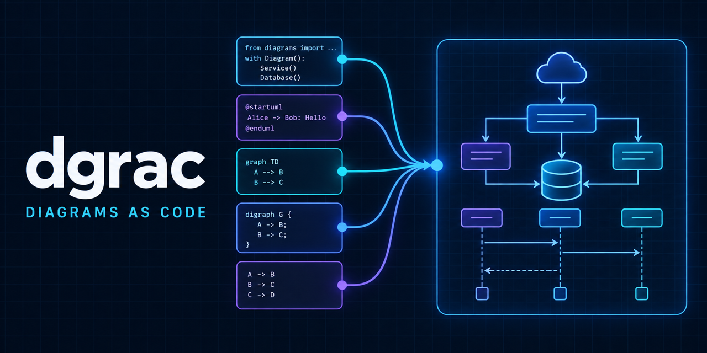

# dgrac — Diagrams as Code



[](https://github.com/stonetoned/diagrams-as-code/actions/workflows/ci.yml)
[](https://github.com/stonetoned/diagrams-as-code/releases)
[](LICENSE)
[](https://scorecard.dev/viewer/?uri=github.com/stonetoned/diagrams-as-code)

One lean, reproducible workflow for **Python diagrams, PlantUML, Mermaid, Graphviz DOT, and D2**. Render cloud architecture, C4 models, UML, sequence diagrams, ER diagrams, state machines, dependency graphs, and infrastructure documentation without installing five toolchains.

`dgrac` is useful for local design work, architecture-as-code repositories, CI/CD documentation, GitHub Actions, and AI coding agents that need a predictable diagram renderer.

## Quick start

Requirements: Docker. Make is optional.

```bash
git clone https://github.com/stonetoned/diagrams-as-code.git
cd diagrams-as-code

./dgrac doctor
./dgrac render --engine mermaid --name architecture
./dgrac render-all
```

Generated files are written under `./output/<engine>/`.

## Why dgrac?

- **One CLI, five engines** — compare tools without changing workflows.
- **Reproducible** — pinned renderer versions and checksum-verified downloads.
- **Lean** — no bundled browser; D2 SVG previews use `rsvg-convert`.
- **Safe defaults** — source mounts are read-only; non-Mermaid renders have no container network access.
- **CI-ready** — root `action.yml`, deterministic exit codes, and dynamic artifact verification.
- **Agent-friendly** — `llms.txt`, `llms-full.txt`, `AGENTS.md`, and JSON example discovery.
- **Flexible** — render this repository's examples or point the CLI at any compatible source tree.

## Engines and diagram types

| Engine | Best for | Input | Output | Network while rendering |
|---|---|---:|---:|---:|
| [Python diagrams](https://diagrams.mingrammer.com/) | Cloud and infrastructure architecture | `.py` | PNG | No |
| [PlantUML](https://plantuml.com/) | UML, C4, deployment, component, sequence | `.puml`, `.uml` | PNG | No |
| [Mermaid](https://mermaid.js.org/) | Flowcharts, sequence, ER, state, docs | `.mmd` | PNG | Kroki endpoint |
| [Graphviz](https://graphviz.org/) | Dependency graphs and precise graph layout | `.dot` | PNG | No |
| [D2](https://d2lang.com/) | Modern architecture and sequence diagrams | `.d2` | SVG + PNG | No |

The examples include simple-to-extreme references plus descriptive modern designs such as `architecture`, `sequence`, `er`, `state`, `deployment`, and `dependency`.

```bash
./dgrac list
./dgrac list --json   # stable machine-readable discovery for agents and scripts
```

## CLI

```text
dgrac render --engine <py|puml|uml|mermaid|dot|d2> --name <file>
dgrac render-all [--source DIR] [--output DIR]
dgrac test       [--source DIR] [--output DIR]
dgrac list       [--source DIR] [--json]
dgrac doctor
```

Common examples:

```bash
./dgrac render -e puml -n deployment
./dgrac render -e mermaid -n sequence -o ./artifacts
./dgrac render -e d2 -n sequence

# Render another repository that uses py/, uml/, mermaid/, dot/, and d2/ folders.
./dgrac test --source ../my-architecture/diagrams --output ../my-architecture/generated
```

Configuration is explicit and environment-friendly:

| Variable | Purpose | Default |
|---|---|---|
| `DGRAC_SOURCE_DIR` | Diagram source root | `./diagrams` |
| `DGRAC_OUTPUT_DIR` | Generated artifact root | `./output` |
| `DGRAC_IMAGE` | Prebuilt renderer image | local build or versioned GHCR image |
| `DGRAC_KROKI_URL` | Mermaid-compatible Kroki endpoint | `https://kroki.io` |
| `DGRAC_BUILD` | Local image policy: `auto`, `always`, `never` | `auto` |

For private diagrams, self-host [Kroki](https://docs.kroki.io/kroki/setup/install/) and set `DGRAC_KROKI_URL`. The other four engines render fully offline.

## Make shortcuts

```bash
make doctor
make render engine=mermaid filename=architecture
make render-all
make test
make refresh-docs
```

## GitHub Action

The repository is also a composite GitHub Action:

```yaml
name: Render architecture diagrams
on: [push, pull_request]

jobs:
  diagrams:
    runs-on: ubuntu-latest
    steps:
      - uses: actions/checkout@v7
      - uses: stonetoned/diagrams-as-code@v0
        with:
          command: test
          source: diagrams
          output: output
      - uses: actions/upload-artifact@v7
        with:
          name: diagrams
          path: output
```

For a single diagram, set `command: render`, `engine`, and `name`.

## AI agents, search, and RAG

The project publishes deliberately concise machine-readable entry points:

- [`llms.txt`](llms.txt) — prioritized documentation map following the llms.txt proposal.
- [`llms-full.txt`](llms-full.txt) — self-contained product and CLI context for retrieval systems.
- [`AGENTS.md`](AGENTS.md) — verified operating instructions for coding agents.
- `dgrac list --json` — discover installed engines and available examples without scraping prose.
- [`codemeta.json`](codemeta.json) and [`CITATION.cff`](CITATION.cff) — structured software identity and citation metadata.

For RAG, index `llms-full.txt` first, then the example source files relevant to the requested engine. These files improve accurate discovery; they do not guarantee ranking or citation by third-party AI systems.

## Source layout

```text
diagrams/
├── py/        # Python diagrams
├── uml/       # PlantUML and C4
├── mermaid/   # Mermaid
├── dot/       # Graphviz DOT
└── d2/        # D2
```

`render-all` discovers supported files dynamically. Add a source file to the matching top-level engine directory; no manifest update is required. `icons.py` is treated as the Python helper module and is not rendered.

## Install the CLI

```bash
make install PREFIX="$HOME/.local"
```

The installed script uses the versioned GHCR image when it is outside a source checkout. Bash and Zsh completions are included.

## Development and verification

```bash
make test-cli      # parser, aliases, errors, and JSON contract
make test-static   # metadata and documentation invariants
make test          # full container build + every renderer + artifact checks
make docs-build    # local Jekyll build
```

See [CONTRIBUTING.md](CONTRIBUTING.md) for the contribution workflow and [SECURITY.md](SECURITY.md) for private vulnerability reporting.

## License

[CC0 1.0 Universal](LICENSE). Use, copy, modify, and redistribute the project without an attribution requirement.
